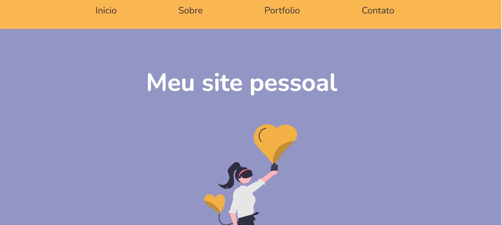

# Projeto Final em ReactJS - PretaLab 💜

---
## Sobre o projeto 🧠

 

 
💻 Nesse projeto treino os conceitos fundamentais de ReactJS aprendido no Ciclo formativo 2 pela PretaLab ✊🏾

---
 

## Resumo dos conteúdos aplicados

* 🗸 O que é e quem usa react
* 🗸 Preparando o ambiente
* 🗸 "Olá, Mundo!"
* 🗸 Componentes e JSX
* 🗸 Props
* 🗸 State
* 🗸 Introdução aos eventos
* 🗸 Listas e chaves
* 🗸 Introdução aos hooks (useState e use Effect)
* 🗸 Como usar css no reactjs
* 🗸 Como criar rotas no reactjs - react router dom
* 🗸 Deploy e configuração para evitar o erro 404

Meu site já está funcionando e você pode acessar aqui 🖱️[Meu site pessoal](https://projeto-final-react-pretalab-gules.vercel.app/)

---

### `Tecnologias usadas`
 

| Ferramenta | Descrição |
| --- | --- |
| `ReactJS` | framework web|
| `Vite` | gerador de projeto de front-end|
| `npm` | gerenciador de pacotes|
| `Firebase` | Ferramenta realtime database para gravar as mensagens de contato|
| `Module CSS` | Ferramenta para ter mais produtividade ao estilizar a aplicação|
| `Phosphor` | Dependência com icones super legais|
| `React router dom` | Dependência para criar rotas no reactjs|
| `Axios` | Dependência para consumir api|
| `Vercel` | Hospedagem para a aplicação, fiz o deploy integrado com o github|
| `Github` | Hospedagem do código fonte integrado com gerenciador de versionamento|

---
 

### `Como rodar o projeto localmente`

Siga os passos e inclua as informações abaixo:

| Passo                       | Comando/informação |
| --------------------------- | ------------------ |
| Faça o fork                 | `botão de forkar`  |
| Faça o clone                | `git clone`        |
| Instale as dependências após acessar a pasta projeto    | `npm i`            |
| Crie as variaveis de ambiente para integrar com Firebase e inclua os valores da sua conta           | `conforme .env.example e lista abaixo`|
| Rode o projeto              | `npm run dev`       |

----
**Variáveis de ambiente**

 * VITE_API_KEY=
 * VITE_AUTH_DOMAIN=
 * VITE_PROJECT_ID=
 * VITE_STORAGE_BUCKET=
 * VITE_MESSAGING_SENDER_ID=
 * VITE_APP_ID=
 * VITE_DATABASE_URL=
-----
 

### 🪄 Próximos passos mapeados

- Incluir Testes
- Revisar acessibilidade
- Revisar responsividade
---
 

### Vamos nos conectar?

- [linkedin](https://www.linkedin.com/in/carolinabarbara-dev/)
- [github](https://github.com/carolinabarbara)

